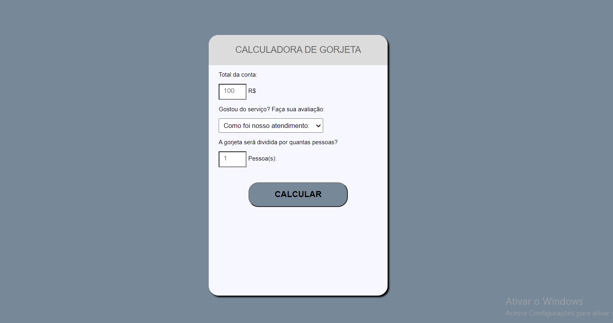

<h1 align="center">  Calculadora de Gorjetas </h1>

 

  

## 🚀 Tecnologias

Esse projeto foi desenvolvido com as seguintes tecnologias:

HTML: Estruturação da interface do usuário.
CSS: Estilização para uma experiência visual agradável.
JavaScript: Lógica de cálculo e interatividade da aplicação.

## 💻 Projeto

A Calculadora de Gorjetas é um projeto desenvolvido para ajudar as pessoas a calcular as gorjetas em restaurantes de forma rápida e eficiente. Com uma interface simples e amigável, essa aplicação permite que os usuários calculem facilmente o valor da gorjeta com base no total da conta, no serviço prestado e no número de pessoas.

## Recursos:

Calculadora Intuitiva: A interface intuitiva da calculadora permite que os usuários insiram facilmente o valor total da conta, escolham o nível de serviço e indiquem o número de pessoas na mesa.

Opções de Serviço: Os usuários podem selecionar o nível de serviço que receberam, como "Ótimo", "Bom" ou "Regular". Essa seleção influenciará o valor da gorjeta a ser calculado.

Divisão da Conta: A calculadora oferece a opção de dividir a gorjeta igualmente entre todas as pessoas na mesa, garantindo que todos contribuam de forma justa.

Exibição Clara dos Resultados: Após o cálculo, os resultados são exibidos de forma clara, mostrando o valor da gorjeta e o valor total a ser pago por pessoa.

## Como Utilizar:

Insira o valor total da conta no campo apropriado.
Escolha o nível de serviço que você recebeu (Ótimo, Bom, Regular).
Indique o número de pessoas na mesa, ou deixe como 1 se estiver sozinho.
Clique no botão "Calcular" para obter o valor da gorjeta e o total a ser pago por pessoa.
A resposta será exibida abaixo, e você terá alguns segundos para visualizá-la antes que ela desapareça.
Motivação:
A Calculadora de Gorjetas foi criada para simplificar um processo comum em restaurantes e bares, tornando mais fácil para os usuários calcular e dividir as gorjetas de forma justa. Além disso, o projeto serve como uma oportunidade de prática para desenvolvedores interessados em aprimorar suas habilidades em HTML, CSS e JavaScript.

## Próximos Passos:
Este projeto pode ser expandido com recursos adicionais, como a possibilidade de personalizar as porcentagens de gorjeta com base em preferências pessoais, suporte para diferentes moedas e até mesmo integração com aplicativos de pagamento.

Status:
O projeto encontra-se em estado funcional e pronto para ser utilizado. Quaisquer melhorias ou recursos adicionais podem ser implementados no futuro.

##  Licença

Esse projeto está sob a licença MIT.

## Creditos
 

Programa exclusivo e gratuito, promovido pela https://start.onebitcode.com/  para ensino de tecnologias WEB.  

